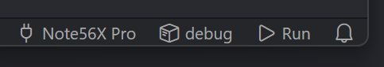
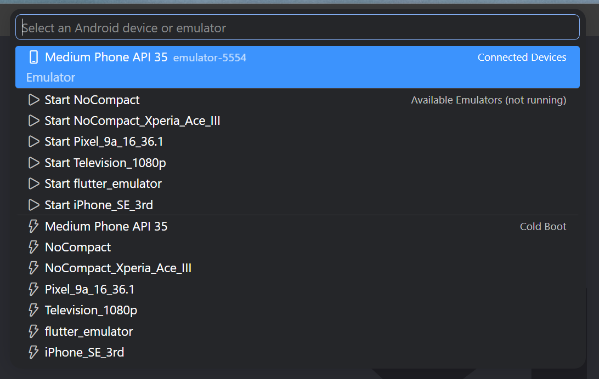

# Android Build & Run

Build, install, and run Android native projects directly from VSCode — no Android Studio required.



## Features

- **Device Selector** — Status bar shows the current device. Click to pick from connected devices or launch an emulator.

  

- **One-Click Run** — Click `▶ Run` in the status bar to build, install, and launch your app.
- **Multi-Device** — Run the app on multiple devices at the same time. Each device gets its own logcat Output Channel.
- **Build Variant Selector** — Auto-scans Gradle build variants (`debug`, `release`, flavors). Click to switch.
- **Emulator Cold Boot** — Restart an emulator from scratch without leaving VSCode.
- **Logcat in Debug Console** — App logs streamed to the Debug Console, filtered by your app's PID.
- **Floating Toolbar** — Stop and restart your app from the debug toolbar, just like Flutter.
- **F5 Support** — Press F5 to build & run via `launch.json`.
- **Auto-detect SDK & JDK** — Finds Android SDK and JDK from environment variables, Android Studio, or common install paths.
- **i18n** — English and Japanese UI.

## Requirements

- **Android SDK** with `adb` and `emulator`
- **Gradle wrapper** (`gradlew` / `gradlew.bat`) in your project root
- An Android project with `build.gradle` or `build.gradle.kts`

## Quick Start

1. Open an Android project folder in VSCode
2. The status bar shows your connected device (or "No Device")
3. Click the device name to select a device or launch an emulator
4. Click **▶ Run** to build and run

## Status Bar

```
[📱 Pixel 7] [▶ Run] [📦 debug]
```

| Item | Description |
|------|-------------|
| `📱 Pixel 7` | Selected device. Click to open device picker. |
| `▶ Run` | Build, install, and launch. Shows spinner during build. |
| `⬜ Stop` | Stop the app on the selected device. Visible only while running. |
| `📦 debug` | Current build variant. Click to change. |

## Extension Settings

| Setting | Default | Description |
|---------|---------|-------------|
| `native-runner.sdkPath` | `""` | Path to Android SDK. Auto-detected if empty. |
| `native-runner.javaHome` | `""` | Path to JDK. Auto-detected if empty. |
| `native-runner.appModule` | `"app"` | App module name (e.g., `app`, `mobile`, `wear`). |
| `native-runner.buildVariant` | `"debug"` | Default build variant. Overridden by variant selector. |
| `native-runner.autoSelectDevice` | `true` | Auto-select a device when one connects. |

## Commands

| Command | Description |
|---------|-------------|
| `Android Runner: Select Device` | Open the device picker |
| `Android Runner: Select Build Variant` | Open the variant picker |
| `Android Runner: Build, Install & Run` | Build and run the app |
| `Android Runner: Stop App` | Stop the running app |
| `Android Runner: Filter Log` | Filter logcat output by text |

## F5 / launch.json

Add to `.vscode/launch.json`:

```json
{
  "type": "native-runner",
  "request": "launch",
  "name": "Android Build & Run"
}
```

## License

MIT
