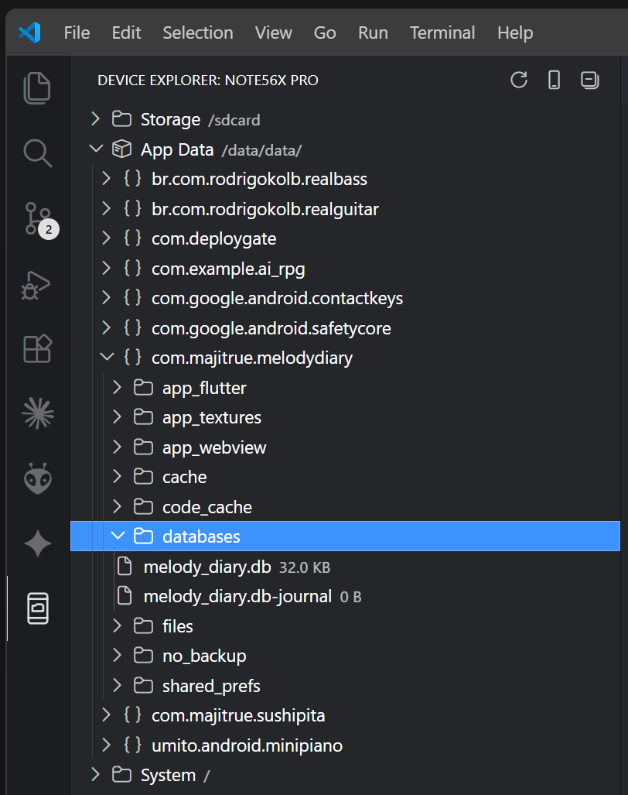

# Android / iOS Build & Run

<a href="#ja">日本語</a>

Build, install, and run Android & iOS apps directly from VSCode. Includes Device File Explorer.


## Features

- **Device Selector** — Status bar shows the current device. Click to pick from connected devices or launch an emulator.

  

- **One-Click Run** — Click `▶ Run` in the status bar to build, install, and launch your app.
- **Multi-Device** — Run the app on multiple devices at the same time. Each device gets its own logcat Output Channel.
- **Build Variant Selector** — Auto-scans Gradle build variants (`debug`, `release`, flavors). Click to switch.
- **Emulator Cold Boot** — Restart an emulator from scratch without leaving VSCode.
- **Logcat in Debug Console** — App logs streamed to the Debug Console, filtered by your app's PID.
- **Floating Toolbar** — Stop and restart your app from the debug toolbar, just like Flutter.
- **F5 Support** — Press F5 to build & run via `launch.json`.
- **Auto-detect SDK & JDK** — Finds Android SDK and JDK from environment variables, Android Studio, or common install paths.
- **Device File Explorer** — Browse, download, upload, and delete files on connected devices. Supports app-private data via `run-as`.

  

  - Drag & drop upload from VSCode explorer
  - Click to open files — save to auto-push back to device (works with any editor, including SQLite3 Editor)
  - Rename, create files/folders, move, copy
  - Drag & drop within tree to move files on device
  - File size warning for large files
  - Cache with configurable expiry (default 7 days)
  - Independent device selection from build controls
- **Feature Toggles** — Show/hide individual features (explorer, device selector, build controls, variant selector) in settings.
- **i18n** — English and Japanese UI.

## Requirements

### Android
- **Android SDK** with `adb` and `emulator`
- **Gradle wrapper** (`gradlew` / `gradlew.bat`) in your project root
- An Android project with `build.gradle` or `build.gradle.kts`

### iOS (macOS only)
- **Xcode** with Command Line Tools
- An Xcode project (`.xcodeproj` or `.xcworkspace`)

## Quick Start

1. Open an Android project folder in VSCode
2. The status bar shows your connected device (or "No Device")
3. Click the device name to select a device or launch an emulator
4. Click **▶ Run** to build and run

## Status Bar

```
[📱 Pixel 7] [▶ Run] [📦 debug]
```

| Item | Description |
|------|-------------|
| `📱 Pixel 7` | Selected device. Click to open device picker. |
| `▶ Run` | Build, install, and launch. Shows spinner during build. |
| `⬜ Stop` | Stop the app on the selected device. Visible only while running. |
| `📦 debug` | Current build variant. Click to change. |

## Extension Settings

| Setting | Default | Description |
|---------|---------|-------------|
| `native-runner.sdkPath` | `""` | Path to Android SDK. Auto-detected if empty. |
| `native-runner.javaHome` | `""` | Path to JDK. Auto-detected if empty. |
| `native-runner.appModule` | `"app"` | App module name (e.g., `app`, `mobile`, `wear`). |
| `native-runner.buildVariant` | `"debug"` | Default build variant. Overridden by variant selector. |
| `native-runner.autoSelectDevice` | `true` | Auto-select a device when one connects. |
| `native-runner.showDeviceExplorer` | `true` | Show Device File Explorer in the sidebar. |
| `native-runner.showDeviceSelector` | `true` | Show device selector in the status bar. |
| `native-runner.showBuildControls` | `true` | Show Build/Run/Stop controls in the status bar. |
| `native-runner.showVariantSelector` | `true` | Show build variant selector in the status bar. |
| `native-runner.explorerFileSizeLimit` | `10` | File size limit (MB) for open/download warnings. 0 to disable. |
| `native-runner.explorerCacheDays` | `7` | Days to keep cached files from Device Explorer. 0 to disable. |
| `native-runner.explorerRefreshOnExpand` | `true` | Re-fetch folder contents on each expand. Set to false for cached mode. |

## Commands

| Command | Description |
|---------|-------------|
| `Native Runner: Select Device` | Open the device picker |
| `Native Runner: Select Build Variant / Scheme` | Open the variant picker |
| `Native Runner: Build, Install & Run` | Build and run the app |
| `Native Runner: Stop App` | Stop the running app |
| `Native Runner: Filter Log` | Filter logcat output by text |
| `Native Runner: Select Explorer Device` | Pick device for file explorer |
| `Native Runner: Download from Device` | Download file/folder from device |
| `Native Runner: Upload to Device` | Upload files to device |
| `Native Runner: New Folder` | Create folder on device |
| `Native Runner: New File` | Create empty file on device |
| `Native Runner: Rename` | Rename file/folder on device |
| `Native Runner: Move To...` | Move file/folder to another location on device |
| `Native Runner: Copy To...` | Copy file/folder to another location on device |

## F5 / launch.json

Add to `.vscode/launch.json`:

```json
{
  "type": "native-runner",
  "request": "launch",
  "name": "Android Build & Run"
}
```

## License

MIT

[⬆️ Top](#android--ios-build--run) | [日本語](#ja)

---

<h2 id="ja">日本語</h2>

VSCode から Android / iOS アプリをビルド・インストール・実行。Device File Explorer 搭載。


## 機能

- **デバイス選択** — ステータスバーに現在のデバイスを表示。クリックでデバイス選択やエミュレーター起動。

  

- **ワンクリック実行** — ステータスバーの `▶ Run` でビルド・インストール・起動。
- **マルチデバイス** — 複数デバイスで同時にアプリを実行。デバイスごとに独立したLogcat出力。
- **ビルドバリアント選択** — Gradleビルドバリアント（`debug`、`release`、フレーバー）を自動スキャン。
- **エミュレーターコールドブート** — VSCodeからエミュレーターを再起動。
- **Debug ConsoleにLogcat** — PIDフィルター付きでアプリログをDebug Consoleに表示。
- **フローティングツールバー** — Flutterと同様のデバッグツールバーで停止・再起動。
- **F5対応** — `launch.json` でF5キーからビルド＆実行。
- **SDK・JDK自動検出** — 環境変数、Android Studio、一般的なパスから自動検出。
- **Device File Explorer** — デバイスのファイルをブラウズ・ダウンロード・アップロード・削除。`run-as` でアプリのプライベートデータにもアクセス。

  

  - VSCodeエクスプローラーからドラッグ&ドロップでアップロード
  - クリックでファイルを開く — 保存時にデバイスへ自動書き戻し（SQLite3 Editor等のカスタムエディタも対応）
  - リネーム、ファイル/フォルダー新規作成、移動、コピー
  - デバイス内ドラッグ&ドロップでファイル移動
  - 大きなファイルのサイズ警告
  - キャッシュ管理（デフォルト7日で自動削除）
  - ビルド用セレクターとは独立したデバイス選択
- **Feature Toggles** — 設定で各機能の表示ON/OFF。
- **多言語対応** — 英語・日本語UI。

## 必要条件

### Android
- **Android SDK**（`adb` と `emulator`）
- プロジェクトルートに **Gradle wrapper**（`gradlew` / `gradlew.bat`）
- `build.gradle` または `build.gradle.kts` を含むAndroidプロジェクト

### iOS（macOSのみ）
- **Xcode**（Command Line Tools含む）
- Xcodeプロジェクト（`.xcodeproj` または `.xcworkspace`）

## クイックスタート

1. VSCodeでAndroidプロジェクトフォルダーを開く
2. ステータスバーに接続中のデバイスが表示される（または「No Device」）
3. デバイス名をクリックしてデバイスを選択またはエミュレーターを起動
4. **▶ Run** をクリックしてビルド＆実行

## ライセンス

MIT

[⬆️ Top](#android--ios-build--run) | [English](#android--ios-build--run)
